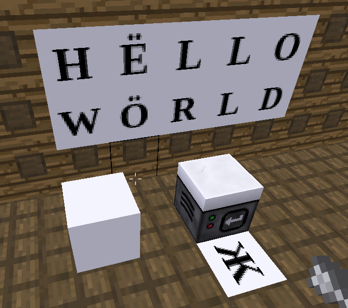
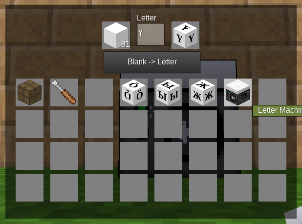

# Ehlphabet

Fork of the original [abjphabet mod](https://forum.luanti.org/viewtopic.php?t=11744) by ABJ

| **Letter Machine Reciepe**             | **Letter Machine UI**          |
| -------------------------------------- | ------------------------------ |
|  |  |

Letter blocks can be created with the Letter Machine or given with /giveme ehlphabet:(ascii decimal)

Example: `/giveme ehlphabet:65` will give you a block with the letter [**A**] on it.
https://www.asciitable.com/

For UTF-8 characters add one more identifier /giveme ehlphabet:(first byte decimal)\_(second byle decimal)

Example: `/giveme ehlphabet:195_132` will give you a block with the letter [**Ä**] on it.
http://www.utf8-chartable.de/

## Textures

Textures were generated using [**phantomjs**](http://phantomjs.org/download.html) script "gen.js" included in this repository.

To (re)generate textures run:

    $ phantomjs gen.js

To customize the look and size of letters, you need to know basic HTML and CSS and change it inside "gen.js".

## License

Textures are licensed under CC-BY-SA 3.0
See LICENSE file for everything else.
